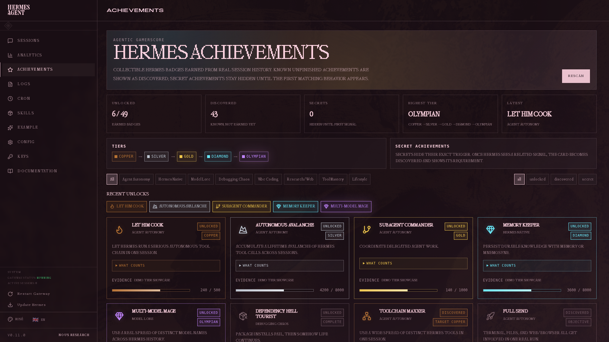
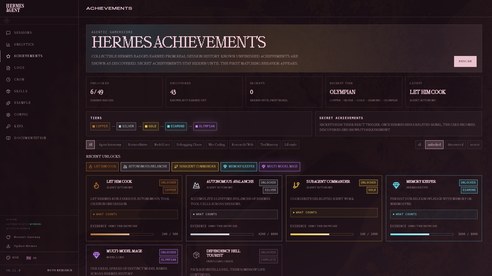

# Hermes Achievements

Achievement system for the Hermes Dashboard: collectible, tiered badges generated from real local Hermes session history.





The screenshots use temporary demo tier data to show the full visual range. The plugin itself reads real local Hermes session history by default.

## What it does

Hermes Achievements scans local Hermes sessions and unlocks badges based on real agent behavior:

- autonomous tool chains
- debugging and recovery patterns
- vibe-coding file edits
- Hermes-native skills, memory, cron, and plugin usage
- web research and browser automation
- model/provider workflows
- lifestyle patterns such as weekend or night sessions

Achievements have three visible states:

- **Unlocked** — earned at least one tier
- **Discovered** — known achievement, progress visible, not earned yet
- **Secret** — hidden until Hermes detects the first related signal

Most achievements level through:

```text
Copper → Silver → Gold → Diamond → Olympian
```

Each card has a collapsible **What counts** section showing the exact tracked metric or requirement once the user wants details.

## Examples

- Let Him Cook
- Toolchain Maxxer
- Red Text Connoisseur
- Port 3000 Is Taken
- This Was Supposed To Be Quick
- One More Small Change
- Skillsmith
- Memory Keeper
- Context Dragon
- Plugin Goblin
- Rabbit Hole Certified

## Install

Clone into your Hermes plugins directory:

```bash
git clone https://github.com/PCinkusz/hermes-achievements ~/.hermes/plugins/hermes-achievements
```

For local development, keep the repo elsewhere and symlink it:

```bash
git clone https://github.com/PCinkusz/hermes-achievements ~/hermes-achievements
ln -s ~/hermes-achievements ~/.hermes/plugins/hermes-achievements
```

Then rescan dashboard plugins:

```bash
curl http://127.0.0.1:9119/api/dashboard/plugins/rescan
```

If backend API routes 404, restart `hermes dashboard`; plugin APIs are mounted at dashboard startup.

## Files

```text
dashboard/
├── manifest.json
├── plugin_api.py
└── dist/
    ├── index.js
    └── style.css
```

## API

Routes are mounted under:

```text
/api/plugins/hermes-achievements/
```

Endpoints:

```text
GET  /overview
GET  /achievements
GET  /recent-unlocks
GET  /sessions/{session_id}/badges
POST /rescan
POST /reset-state
```

## Development

Run checks:

```bash
node --check dashboard/dist/index.js
python3 -m py_compile dashboard/plugin_api.py
python3 -m unittest tests/test_achievement_engine.py -v
```

## License

MIT
